# Machine Learning from Scratch
This project folder contains regression, classification, clustering and neural network models made from Scratch using Numpy and Python, with a small portion using Pandas for Data Cleaning. The purpose of this project folder was to delve deeper into the foundation of Supervised and Unsupervised Learning concepts as well as understand the mathematical and algorithmic complexity of the solutions.

Every algorithm is written out by hand with NumPy - no Scikit-Learn, PyTorch or TensorFlow for the model itself. Each notebook states what the algorithm does, gives the mathematics in LaTeX, walks through the class line by line, runs it on a real dataset and plots the result. Where a model has hand-derived gradients, a finite-difference check is printed in the notebook so the derivatives can be seen to match the loss rather than taken on trust.

Two notebooks cache a dataset download into `data/`. Everything else pulls from the UCI repository at run time through `ucimlrepo`.

## Layout
<hr>

```
regression/        linear_regression, ridge_lasso_elasticnet
classification/    logistic_regression, k_nearest_neighbors, support_vector_machine,
                   naive_bayes, lda_qda, random_forest, xgboost
clustering/        k-means, mean_shift, dbscan, birch, gmm, dirichlet_process_mixture
dimensionality_reduction/
                   pca, ica, tsne
neural_networks/   mlp, 2d_cnn, 3d_cnn, autoencoder, rnn_lstm, transformer, bert, gan
animations/        one animation per notebook, with the scripts that build them
```

## Regression
### Linear Regression
<hr>
`regression/linear_regression.ipynb` - predicts fuel economy in miles per gallon. The `Linear_Regression` class fits `y = w.x + b` by gradient descent on the mean squared error, and the notebook works through the R-squared theory: `SS_res`, `SS_tot`, why R-squared is the fraction of variance the model accounts for, why it can go negative on held-out data, and why adjusted R-squared exists. Weight alone gives a test R-squared of 0.766, and all seven features together give 0.843 at an RMSE of 3.19 mpg.

The closed-form normal equation is implemented alongside it as a check, and gradient descent lands on the same coefficients to within 5.4e-14. Feature scaling is shown rather than asserted: with raw features gradient descent either diverges to infinity in 28 iterations or, at a learning rate small enough to survive, crawls to an R-squared of -0.30. The noise-column experiment confirms that training R-squared rises every time a useless random feature is added while adjusted R-squared falls.

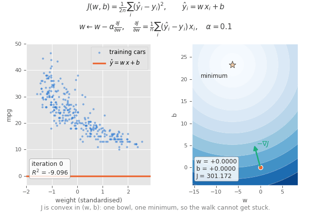

*Gradient descent on the MSE bowl. The arrow is the negative gradient, always perpendicular to the contour it crosses, shrinking to nothing at the minimum.*

### Ridge, Lasso and Elastic Net
<hr>
`regression/ridge_lasso_elasticnet.ipynb` - predicts violent crime rate from 100 community attributes. Ridge is solved in closed form as `(X'X + lambda*I)^-1 X'y` and again by gradient descent to show they agree. Lasso has no closed form and is not differentiable at zero, so it is solved by coordinate descent with the soft-thresholding operator, which is what produces coefficients that are exactly zero rather than merely small. Elastic Net combines both penalties. The notebook gives the geometric argument for why the L1 constraint region, being a diamond with corners on the axes, puts the solution on an axis while the L2 sphere does not.

Lasso sets 42 of 100 coefficients to exactly zero and still matches ridge on test R-squared at 0.656, against 0.647 for ordinary least squares. The more useful result is the training-size sweep: at 80 training rows OLS scores a test R-squared of -1.09, worse than predicting the mean, while ridge holds 0.594. Regularisation earns its place when data is scarce relative to the number of features, not merely when features are correlated.


*A growing RSS contour first touches the L2 disc at a generic point, but touches the L1 diamond at a corner - and the corners sit on the axes, which is why lasso produces coefficients that are exactly zero.*

## Classification
### Logistic Regression
<hr>
`classification/logistic_regression.ipynb` - covers both the two-class and the many-class case. The `Logistic_Regression` class puts a sigmoid on a linear score, so the model is linear in the log-odds, and trains on binary cross-entropy. The `Softmax_Regression` class generalises it to three classes with the softmax, trained on categorical cross-entropy. The notebook derives why squared error is not used here, and why the sigmoid derivative cancelling against the log-loss derivative leaves the same clean gradient in both cases.

On the banknote data a single feature reaches 84.6% and all four reach 98.3%; the softmax reaches 98.2% on the Iris training set. The sigmoid and softmax functions are plotted in their own right, and the notebook asserts the identities directly - softmax rows sum to 1 to within 2.2e-16, and at two classes the softmax equals the sigmoid of the score difference with a maximum difference of exactly zero.

### K-Nearest Neighbors
<hr>
`classification/k_nearest_neighbors.ipynb` - classifies tumour samples as benign or malignant. There is no training step at all: the stored data is the model, and a prediction is just measuring the distance to every training point, keeping the `k` closest, and taking a majority vote. It reaches 97.8% at `k = 5` and 98.5% at `k = 7`, with `k = 1` the weakest setting at 94.9% because it copies its answer from a single neighbour with nothing to outvote it. The notebook draws one prediction in full, showing the 5 neighbours splitting 3-2 on a sample near the boundary, and maps the decision boundary, which follows the shape of the data rather than any fitted line.

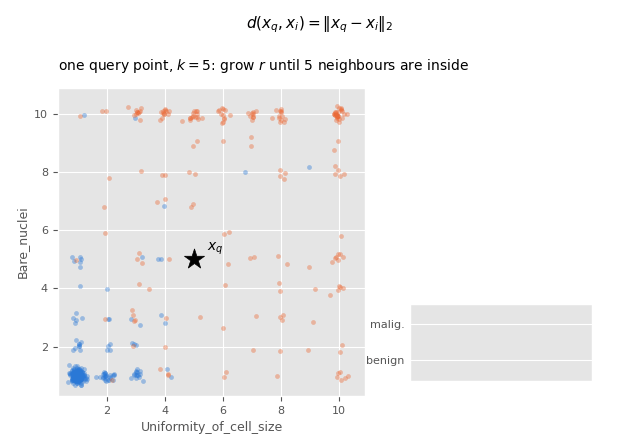

*The query ball growing until it captures k neighbours, then the vote - followed by the same query at a much larger k, and the two decision boundaries side by side.*

### Support Vector Machine
<hr>
`classification/support_vector_machine.ipynb` - separates `Iris-setosa` from `Iris-versicolor` using the two petal measurements. The `Support_Vector_Machine` class searches for the widest margin directly: it shrinks `w` step by step, keeps every candidate that satisfies `y * (w . x + b) >= 1` for all points, and takes the one with the smallest magnitude. The notebook derives why the margin width is `2/|w|`, so minimising `|w|` is the same as maximising the margin. It separates all 100 flowers correctly with a margin of 1.27, and draws the boundary, the two margin lines and the support vectors that hold them in place. This search needs a problem a straight line can split perfectly, which is why those two clearly separated species were used.


*Many lines separate the two species; only one maximises the gap. Fixing the margin lines at plus and minus one gives margin = 2/||w||, so widening the margin and shrinking w are the same request.*

### Naive Bayes
<hr>
`classification/naive_bayes.ipynb` - classifies emails as spam or not. Fitting is pure counting with no iterative optimisation at all, which is what separates it from everything else here. Two variants are built: Gaussian on the raw word frequencies, and Bernoulli on the same features binarised at zero.

The Bernoulli model wins at 88.4% against the Gaussian model's 82.7%, and the notebook explains why the cruder model is the better one - the word-frequency columns are zero-inflated percentages that a bell curve fits badly, so asking only whether a word appeared matches the data's actual shape. The Gaussian model's higher recall is a symptom rather than a virtue: it produces 145 false positives against 32, which for a spam filter is the expensive error. Prediction is done in log space, and the notebook shows why concretely - the raw product of 57 densities hits exactly 0.0 at feature 31, and 227 of 921 test emails underflow to a coin flip.

### Linear and Quadratic Discriminant Analysis
<hr>
`classification/lda_qda.ipynb` - classifies wine cultivars from chemical measurements. Both model each class as a multivariate Gaussian and classify by maximum posterior; the only difference is that QDA estimates a separate covariance per class while LDA pools one across all of them. The notebook shows the algebra: with a shared covariance the quadratic term is identical for every class and cancels in the argmax, leaving a discriminant that is linear in `x`. That is why LDA draws straight boundaries and QDA draws curved ones, shown side by side.

LDA also works as a projection. The eigenvectors of `S_W^-1 S_B` give the directions that maximise between-class over within-class scatter, and the notebook confirms the `C-1` bound numerically: the eigenvalues are 9.095, 3.970, then below 1.2e-15, so exactly two discriminants carry all the separation for three classes. The training-size curve is the substantive result - QDA collapses to 0.399 accuracy at 42 training rows, and the notebook diagnoses why rather than leaving it unexplained: at that size the largest class crosses `N_c > D` and reaches full rank while the others stay deficient, so their inflated inverses hand out enormous penalties and nearly every prediction falls onto the single full-rank class.

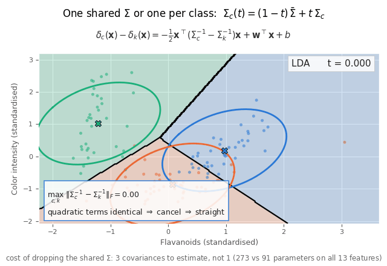

*Interpolating each class covariance from the pooled estimate to its own. At t=0 the quadratic term cancels and the boundary is straight; by t=1 it survives and the boundary is a conic.*

### Random Forest
<hr>
`classification/random_forest.ipynb` - predicts the presence of heart disease. A `Decision_Tree` splits on `feature <= threshold`, picking the split that most reduces Gini impurity, and `Random_Forest` grows 100 of them, each on a bootstrap sample and each considering only a random subset of features at every split. Predictions are a majority vote. Trees split on thresholds, so no scaling is needed anywhere.

A single tree scores 1.000 on the training rows and 0.773 on the test set - it memorises. The forest reaches 0.867, and the out-of-bag score, which costs nothing extra because each tree skips about a third of the rows, comes to 0.833. The measured out-of-bag fraction is 0.370 against the predicted `(1 - 1/n)^n = 0.367`. The depth sweep shows the single tree peaking at depth 3 and decaying afterwards while the forest holds steady at every depth.

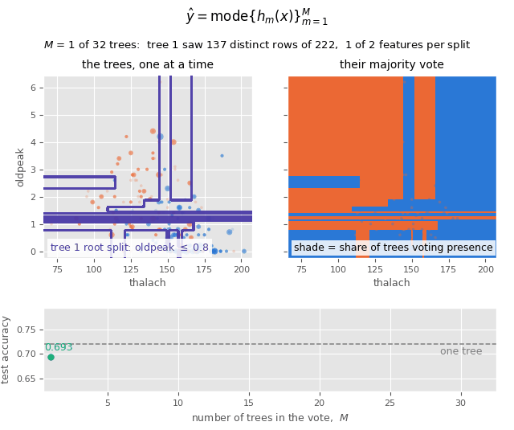

*Individual trees disagreeing wildly on the left, their majority vote smoothing on the right. The trees are not improved - their errors simply are not the same errors.*

### XGBoost
<hr>
`classification/xgboost.ipynb` - the same heart disease problem, so bagging and boosting can be compared directly. Where the forest grows independent trees in parallel to cut variance, boosting grows them in sequence, each fitted to the gradients left over by the ones before it. The notebook derives the second-order method properly: the Taylor expansion of the loss, the leaf weight `-G/(H+lambda)` that falls out of it, the similarity score, and the split gain with its `gamma` penalty.

Test log loss bottoms at 0.364 on round 65 and then climbs for the remaining rounds while training loss keeps falling - the overfitting signature that a random forest does not have. Of 277,616 candidate splits scored, 35.6% are rejected by `gamma` and only 932 are taken; 157 nodes had a genuinely positive gain and were still left as leaves. Splitting stops entirely at round 160, after which `gamma` prunes every tree down to a single leaf.

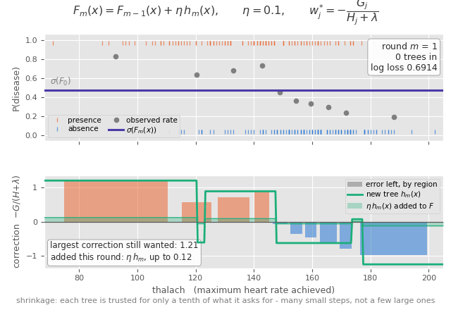

*Each new tree fitted to what the ensemble still gets wrong, with shrinkage adding only a tenth of what it asks for.*

## Clustering
### K-Means
<hr>
`clustering/k-means.ipynb` - clusters the Iris flowers into 3 groups. The `K_Means` class keeps a dictionary of centroids and a dictionary of the points belonging to each one, then repeats two steps until nothing moves: put every point with its closest centroid, and move each centroid onto the average of its own points. Running it on Iris settles in 12 passes and lines up with the true species 88.7% of the time, with the elbow in the inertia curve correctly pointing at `k = 3`. Every mistake falls between `versicolor` and `virginica`, the two species that genuinely overlap.

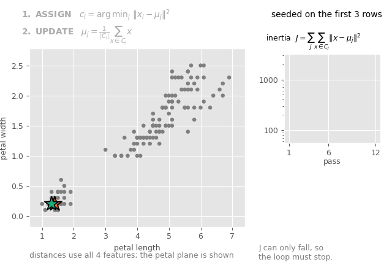

*Lloyd's two steps drawn separately - assign, then update - with the inertia falling monotonically, which is why the loop must stop.*

### Mean Shift
<hr>
`clustering/mean_shift.ipynb` - separates skin from non-skin pixels without being told how many groups to look for. Every point starts as its own centroid and each pass moves it to a distance-weighted average of the points around it, so nearby points pull harder than distant ones, which walks the centroid to the nearest peak in the density. The notebook shows the update is gradient ascent on a kernel density estimate, with the step size chosen for you. Centroids that land on the same peak are merged, and the number of survivors is the number of clusters. It is given a `bandwidth`, not a `k`.

This dataset was chosen because it is a case where K-Means fails. The skin and non-skin pixels form two long parallel bands in colour space, and the non-skin band is far wider and splits into several concentrations of its own. K-Means given the correct `k = 2` scores 79.9%, which is exactly the score for labelling every pixel non-skin - it cuts straight across both bands rather than along them, because splitting the large diffuse region lowers the total squared distance more than isolating the small tight one. Mean Shift at `bandwidth = 0.45` finds 8 clusters and reaches 96.6%, holding the skin pixels in two of them and leaving the rest pure. K-Means only catches up once it is given a `k` well above the number of classes, which means already knowing how the answer should come out.

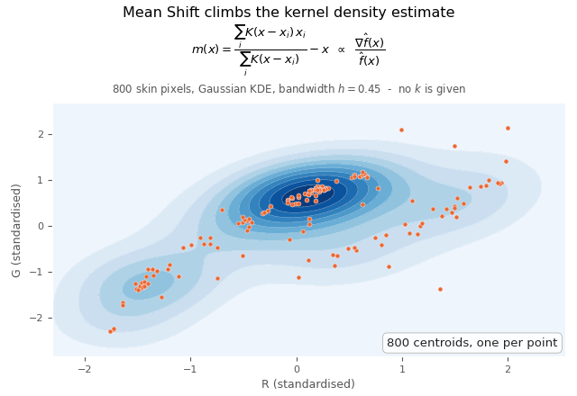

*Every point walking uphill on the kernel density estimate. The number of clusters is however many peaks the walkers end up sharing; it is never supplied.*

### DBSCAN
<hr>
`clustering/dbscan.ipynb` - groups wholesale customers by their annual spending. DBSCAN is the only clustering method here that can refuse to assign a point, labelling it noise instead. The notebook defines core points, density reachability and density connectedness precisely, and explains why a definition built only from local neighbourhoods can follow a cluster of any shape, unlike K-Means which always produces straight-edged convex cells. `eps` is chosen from the knee of the k-distance plot rather than guessed.

The honest headline is that at the knee it finds one cluster and 27 noise points. After the log transform the 440 clients form a single connected density region - restaurants and retailers buy different things but shade continuously into each other, so there is no low-density valley to cut along. Tightened to two clusters it separates a detergent-heavy retail group from a frozen-and-fresh restaurant group, but at the cost of calling 62% of clients noise. An inline K-Means scores 0.859 across all 440 clients where DBSCAN manages 0.880 over only the 167 it will assign, and the notebook says outright that K-Means is the more useful answer if the goal is segmenting everyone.

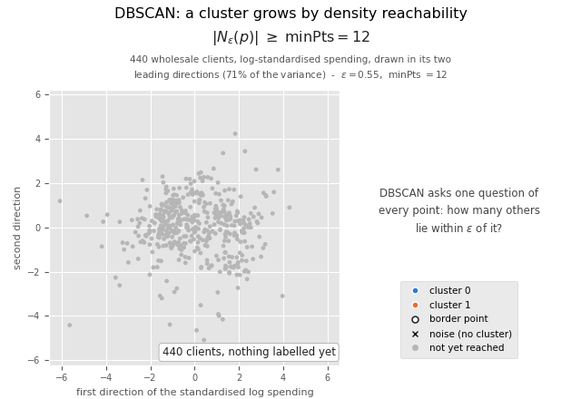

*The eps-ball test sorting points into core, border and noise, then a cluster creeping along the dense region and stopping at the sparse gap.*

### BIRCH
<hr>
`clustering/birch.ipynb` - clusters all 245,057 skin-segmentation pixels in a single pass. Every node of the CF-tree stores only a triple `(N, LS, SS)` - count, linear sum and sum of squares - and the notebook derives the identity that lets centroid, radius and diameter be recovered from those three numbers alone, so no individual point is ever revisited. Merging two summaries is plain addition, which is what makes one pass sufficient.

It summarises the full dataset in 1.5 seconds into a depth-5 tree of 3,439 leaf entries, a 71x compression, and 99.3% of those entries are more than 95% one class, holding 99.7% of the pixels. The global clustering step then merges them into one dominant cluster at 0.792 purity, exactly the majority baseline. The notebook reports this plainly: the summarisation worked and the spherical-cluster assumption in the final step destroyed it, on data that forms two elongated bands. For context, the mean shift notebook could only attempt 800 rows of this same dataset.

### Gaussian Mixture Model
<hr>
`clustering/gmm.ipynb` - fits three Gaussians to the wine data by Expectation-Maximisation. The E-step computes the responsibility of each component for each point, the M-step updates the weights, means and full covariances as responsibility-weighted sample statistics, and the log-likelihood is guaranteed never to decrease. The notebook shows K-Means is the limiting case as the covariances shrink to spherical, which is the cleanest way to say what a GMM adds - soft assignment and cluster shape.

On this data GMM and K-Means produce the identical partition, 0 of 178 wines differ, and the notebook says so rather than manufacturing a win. What BIC prefers is the diagonal model: full covariance spends 234 extra parameters to gain 474.8 log-likelihood units, which BIC charges 1212.5 for, a net loss. The singularity pathology is demonstrated numerically - with the covariance ridge removed, collapsing one component onto a single wine drives the log-likelihood without bound and overtakes the legitimate fit, so the true maximum-likelihood optimum is a degenerate solution that explains nothing.

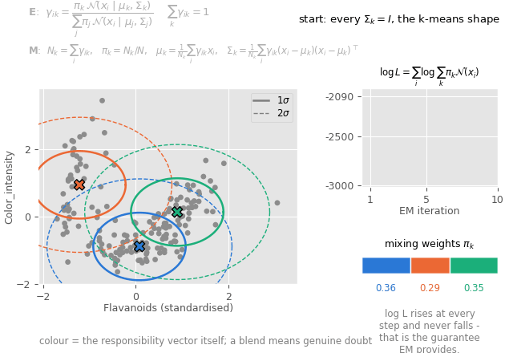

*EM alternating E-step and M-step. Colours are blended responsibilities, so genuine doubt is visible; the log-likelihood only ever rises.*

### Dirichlet Process Mixture
<hr>
`clustering/dirichlet_process_mixture.ipynb` - the same wine data, but the number of components is inferred rather than supplied. A Normal-Inverse-Wishart prior lets the component parameters be integrated out analytically, so collapsed Gibbs sampling only ever samples assignments, each drawn from the Chinese Restaurant Process prior times the posterior predictive likelihood. Clusters can appear and disappear during sampling, so the count is read off the posterior instead of chosen.

At `alpha = 1` the posterior settles on a mode of 7 components against 3 true cultivars, with purity 0.926 and ARI 0.619 - over-segmentation is the normal and expected behaviour, and the notebook reports it rather than tuning until it outputs 3. The `alpha` sweep shows the count rising from 3.03 at `alpha = 0.05` to 31.3 at `alpha = 100`, tracked against the `alpha*log(1 + N/alpha)` prediction. The real point is that choosing `k` has been traded for choosing `alpha` and the base measure, not eliminated.


*Customers join a table in proportion to its size or open a new one in proportion to alpha. The door never closes, so the number of clusters is unbounded and inferred rather than chosen.*

## Neural Networks
### Multi-Layer Perceptron
<hr>
`neural_networks/mlp.ipynb` - classifies the handwritten digits with a plain feed-forward network. The notebook derives the backpropagation recurrence rather than stating it, starting from `delta = p - y` at the output and chaining backwards. Depth is measured rather than assumed: 0 hidden layers gives 0.954, one gives 0.967, two gives 0.976, three gives 0.977, so the returns flatten quickly. The no-activation experiment shows why non-linearity matters - remove the ReLU and the network collapses to a single linear map no matter how many layers it has.

The comparison with the convolutional notebook is the useful part. The MLP reaches 0.977 with 13,130 weights against the CNN's 0.979 with 1,610, so the CNN matches it using an eighth of the parameters. The first-layer weights drawn as 8x8 images explain the gap: they are whole-image templates tied to absolute position, which is exactly what weight sharing in a convolution avoids.

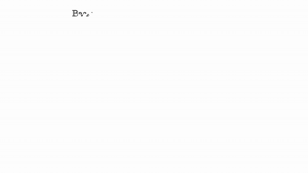

*Backpropagation is the chain rule on a composition. The transpose sends error back along the forward edges; the ReLU derivative gates it to 0 or 1.*

### 2D Convolutional Neural Network
<hr>
`neural_networks/2d_cnn.ipynb` - two sections. The first classifies 8x8 handwritten digits with 16 filters of 3x3, ReLU, 2x2 max pooling and a dense layer - 1,610 weights, reaching 97.9%. Both directions are written by hand: the gradient for a filter is the patch it was looking at, and pooling passes gradient back only to the value that won its block, chosen by `argmax` so ties cannot multiply it. A finite-difference check confirms the derivatives to eight decimal places. A full walkthrough shows one digit at every stage, with the spatial size shrinking 8 to 6 to 3.

The second section moves to CIFAR-10, which is genuine 32x32 RGB, because UCI has no colour image data with a pixel grid. The convolution is generalised to three input channels - 27 weights per filter instead of 9 - and proved to be a strict generalisation by running both versions on single-channel input for a difference of exactly 0.0. On four classes it reaches 73.3% against a 25% baseline. The learned filters render directly as colour patches, and splitting each into its brightness and colour-opposition parts shows 10 of 16 responding mainly to colour, an axis that does not exist on greyscale digits.

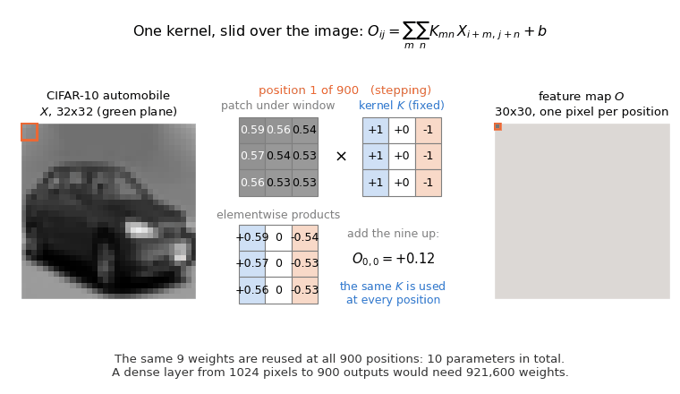

*One 3x3 kernel sliding over a photograph. The same nine weights are reused at all 900 positions - 10 parameters against the 921,600 a dense layer would need.*

### 3D Convolutional Neural Network
<hr>
`neural_networks/3d_cnn.ipynb` - two sections. The first uses Landsat satellite data, where each row is a 3x3 neighbourhood of pixels in 4 spectral bands and therefore reshapes directly into a `(3,3,4)` volume with no transformation. The notebook verifies that column layout empirically from three independent pieces of evidence rather than trusting the documentation. It reaches 90.5% against a 24.4% baseline, and an ablation measures what the third dimension buys: the centre pixel alone gives 85.4%, so the eight neighbours are worth five points.

The second section uses ModelNet10 CAD meshes, which are truly volumetric. The `.OFF` parser and the voxeliser are both written from scratch - triangles are sampled with probability proportional to area, points are placed inside them by the barycentric map, and the results are binned into a 16x16x16 occupancy grid. On five object classes it reaches 96.0% against a 20% baseline, and the notebook explains why that number is high for an uninteresting reason: ModelNet10 is canonically aligned, so absolute voxel position carries most of the signal. A dense softmax on the raw voxels already gets 92.4%, making the convolution worth only 3.6 points.

### Autoencoders
<hr>
`neural_networks/autoencoder.ipynb` - compresses the handwritten digits through a bottleneck and reconstructs them, using no labels at all. Three variants are built: linear, non-linear with ReLU hidden layers, and denoising.

The linear autoencoder matches PCA almost exactly - at a bottleneck of 8 the reconstruction errors are 1.5555 and 1.5603 - but the weight matrices are completely different, with `Wd Wd'` off-diagonals up to 4.75. The notebook checks the claim correctly by comparing subspaces rather than weights: principal angles stay under 15 degrees and the overlap runs 0.992 to 0.9999 against random baselines of 0.014 to 0.51. Same subspace, different basis, because any invertible transform of the code leaves the loss unchanged. The non-linear model then beats PCA by 24% to 53% depending on bottleneck size, and a 1-nearest-neighbour probe shows a 2-dimensional autoencoder code preserving 0.827 label agreement where 2-component PCA manages 0.542.

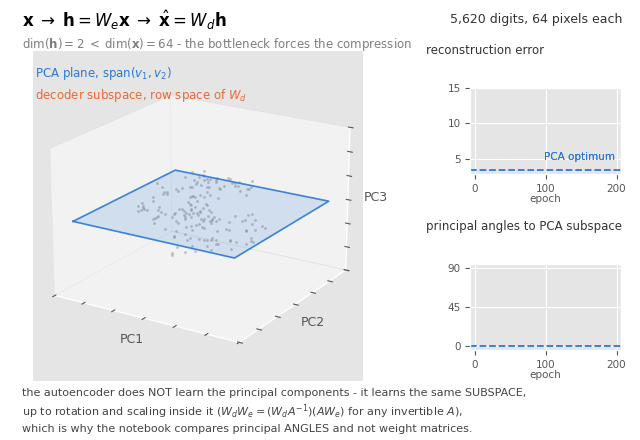

*The decoder's plane settling onto the PCA subspace, with the principal angles collapsing from 86 degrees to 4.*

### Recurrent Neural Networks and LSTMs
<hr>
`neural_networks/rnn_lstm.ipynb` - classifies DNA sequences by whether their centre is a splice junction. Both an Elman RNN and an LSTM are built with backpropagation through time written by hand, and gradient checks agree to 3.3e-11 and 2.1e-11.

The RNN reaches 89.2% and the LSTM 83.9% against a 52.2% baseline, so the gated model does not win on accuracy here, and the notebook says so. The real result is the gradient measurement. Tracking the norm of the loss gradient with respect to the hidden state at every timestep shows the RNN's signal decaying by a factor of 12 across 60 steps while the LSTM's ratio is 0.954, essentially flat, with a per-step decay of 1.0008. The LSTM does fix the vanishing gradient - it simply is not needed on 60-base sequences whose discriminative motif sits in the middle.

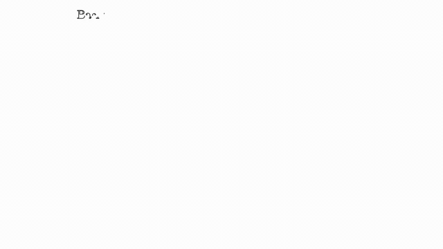

*The gradient reaching an early time step is a product of Jacobians, so it decays geometrically. The LSTM cell state carries an additive, gated path that does not.*

### Transformers
<hr>
`neural_networks/transformer.ipynb` - two parts. The encoder classifies the same DNA sequences and reaches 95.5%, the best result on this dataset, using scaled dot-product attention, multi-head splitting, sinusoidal positional encoding, residuals and layer normalisation, all with hand-written backward passes including through the softmax inside attention. Removing the positional encoding drops it to 55.2%, near the baseline, confirming that attention on its own is permutation-equivariant and cannot locate anything.

The second part adds a decoder and trains it to produce the reverse complement of a sequence, a genuine sequence-to-sequence task on the same data. Causal masking, cross-attention, teacher forcing and greedy autoregressive decoding are all implemented. The mask is verified directly rather than assumed: with it, perturbing later inputs changes earlier outputs by exactly 0.0; without it, by 1.8e-2, which is what would let teacher-forced training read the answers.


*Scores are a sum of d_k unit-variance terms, so their spread grows as sqrt(d_k). Without the divisor the softmax saturates and its gradient vanishes.*

### BERT
<hr>
`neural_networks/bert.ipynb` - takes the same encoder and pretrains it with masked language modelling on unlabelled sequences before fine-tuning it on the labels. 15% of positions are selected and replaced under the 80/10/10 rule, and the notebook explains why that split exists: `[MASK]` never appears at fine-tuning time, so training only on masked tokens would create a mismatch.

The claim that pretraining helps most when labelled data is scarce is tested rather than asserted, across five training-set sizes with three seeds each. At 50 labels the pretrained model reaches 0.679 against 0.537 from random initialisation, a gap of 14 points, where the from-scratch model is barely above the 0.519 baseline. At 100 labels the gap is 15 points. By the full 2,552 labels it narrows to 5 points, 0.921 against 0.868. The shape of that curve is the result.

### Generative Adversarial Network
<hr>
`neural_networks/gan.ipynb` - a generator and a discriminator trained against each other, both written by hand with no autodiff. This is the only notebook here where no single scalar is being minimised: the two networks optimise opposing objectives, so `min_G max_D V(D,G)`, and "converged" means an equilibrium rather than a minimum. The loss curves are therefore flat and oscillating by design, and progress is measured outside the objective by counting how many modes the generator covers.

The non-saturating trick is derived rather than asserted. The gradient ratio between the two generator losses is exactly `(1-D)/D`, measured here reaching 9.29e9 once the discriminator drives `D(G(z))` toward zero - which is why maximising `log D(G(z))` replaces minimising `log(1 - D(G(z)))`. The optimal discriminator `D*(x) = p_data/(p_data + p_g)` is verified numerically, with `V(D*,G)` matching `2*JSD - log4` to 8.5e-08. Gradient checks on both networks agree to 3.37e-11.

Both failure modes are shown rather than described. A 2D ring of eight Gaussians is the vehicle: a healthy run captures 8/8 modes at a mode-histogram KL of 0.0286, letting the generator run ahead collapses it to 1/8 at a KL of exactly `log 8`, and letting the discriminator run ahead pins its accuracy on fakes at 1.000 and leaves 3/8. Two findings run against the folklore and are called out as such: the saturating loss still trains this problem fine under Adam, and the non-saturating loss does not fix non-convergence - on the Dirac GAN it converts a divergent spiral into a limit cycle that crosses zero 63 times without settling.

## Dimensionality Reduction
### Principal Component Analysis
<hr>
`dimensionality_reduction/pca.ipynb` - derives PCA twice, as the directions of maximum projected variance and as the best rank-k reconstruction, and shows the two give the same answer. Centring is shown to be mandatory rather than cosmetic, eigenvalues are related to the variance along each component, and the SVD route is compared against eigendecomposing the covariance matrix with the numerical argument for preferring it. Cross-links to the autoencoder notebook, which proves a linear autoencoder converges to this same subspace.

### Independent Component Analysis
<hr>
`dimensionality_reduction/ica.ipynb` - solves a different problem from PCA: PCA finds uncorrelated components, ICA finds statistically independent ones. The notebook builds the blind-source-separation setup `x = As`, derives the FastICA fixed-point iteration by hand, and explains the one fact that governs everything else - Gaussian sources cannot be separated at all, because any rotation of independent Gaussians is again independent Gaussians, which is why non-Gaussianity is the contrast function. PCA is run on the same mixture and shown failing to separate it, which is the argument for ICA existing. The two inherent ambiguities, component order and scale, are stated rather than hidden.

### t-SNE
<hr>
`dimensionality_reduction/tsne.ipynb` - builds the conditional Gaussian affinities, the symmetrised `p_ij`, and the binary search over each `sigma_i` that hits a target perplexity, which is the step most explanations skip. The KL(P||Q) gradient is derived by hand and confirmed with a finite-difference check. The heavy-tailed Student-t in the map is motivated by the crowding problem: a high-dimensional space has far more room at moderate distance than a plane can provide, and the heavy tail lets a moderate distance map to a larger one. The caveats get their own treatment, since this is where t-SNE is most often misread - cluster sizes and inter-cluster distances carry no meaning, and the result depends on perplexity and seed, shown directly by running the same data at several perplexities.

## Coming next
<hr>
Basic recommender systems and reinforcement learning.

## Datasets
### Iris Flower Classification
<hr>
The <a href="https://archive.ics.uci.edu/dataset/53/iris"> data </a> consists of 150 rows of Iris flower samples with 50 instances for each category - `Iris setosa`, `Iris versicolor`, and `Iris virginica`. It consists of 5 variables aka 5 columns with `petal-length`, `petal-width`, `sepal-length` and `sepal-width` as features and `class` as the output label. Used by K-Means, the Support Vector Machine and the softmax half of Logistic Regression.

### Optical Recognition of Handwritten Digits
<hr>
The <a href="https://archive.ics.uci.edu/dataset/80/optical+recognition+of+handwritten+digits"> data </a> contains 5,620 handwritten digits, roughly 560 of each digit from 0 to 9. Each row holds 64 values which are an 8x8 image flattened out, with each pixel running from 0 to 16, so reshaping a row back to 8x8 gives a picture that can be looked at directly. This is the only UCI dataset used here whose features have a spatial layout rather than being an unordered list, which is what the convolutional network needs. Used by the 2D CNN, the MLP and the Autoencoders, so the three can be compared on identical data.

### Breast Cancer Wisconsin
<hr>
The <a href="https://archive.ics.uci.edu/dataset/15/breast+cancer+wisconsin+original"> data </a> contains 699 tumour samples with 9 features - `clump-thickness`, `uniformity-of-cell-size`, `uniformity-of-cell-shape`, `marginal-adhesion`, `single-epithelial-cell-size`, `bare-nuclei`, `bland-chromatin`, `normal-nucleoli` and `mitoses` - each recorded on a scale of 1 to 10, with `class` as the output label where 2 is benign and 4 is malignant. 16 rows have a missing `bare-nuclei` value and are dropped, leaving 683. Because every feature already shares the same scale, no scaling is needed before measuring distances. Used by K-Nearest Neighbors.

### Auto MPG
<hr>
The <a href="https://archive.ics.uci.edu/dataset/9/auto+mpg"> data </a> contains 398 cars with 7 features - `displacement`, `cylinders`, `horsepower`, `weight`, `acceleration`, `model-year` and `origin` - and fuel economy in miles per gallon as the output label, ranging from 9.0 to 46.6. Six rows have a missing `horsepower` value and are dropped, leaving 392. `weight` alone predicts the target strongly enough to draw a fitted line through, which is what makes it readable. Used by Linear Regression.

### Banknote Authentication
<hr>
The <a href="https://archive.ics.uci.edu/dataset/267/banknote+authentication"> data </a> contains 1,372 banknotes with 4 features taken from photographs - `variance`, `skewness`, `curtosis` and `entropy` of the wavelet-transformed image - and `class` as the output label, where the two classes are genuine and forged. The split is reasonably even at 762 to 610 and the classes are close to separable on the full feature set, which makes it a clean test for a linear classifier. Used by the binary half of Logistic Regression.

### Heart Disease Samples
<hr>
The <a href="https://archive.ics.uci.edu/dataset/45/heart+disease"> data </a> contains 303 instances of patient samples with 13 features determining the presence of a heart disease. Experiments have concentrated on simply attempting to distinguish presence (values 1,2,3,4) from absence (value 0). Four rows are missing `ca` and two are missing `thal`, so 297 remain once they are dropped. The tree models need no scaling, since a tree splits on thresholds rather than distances. Used by Random Forest and XGBoost on the same split, so bagging and boosting can be compared directly.

### Communities and Crime
<hr>
The <a href="https://archive.ics.uci.edu/dataset/183/communities+and+crime"> data </a> contains 1,994 US communities with 127 attributes covering demographics, income, housing and policing, and violent crimes per capita as the output label, already normalised to the range 0 to 1. Missing values are encoded as the string `?` rather than as blanks. Five identifier columns are dropped along with 22 police-survey columns that are missing for 84% of rows, leaving 100 features over 1,993 communities. With that many correlated predictors and comparatively few rows it is the natural test for penalised regression. Used by Ridge, Lasso and Elastic Net.

### Spambase
<hr>
The <a href="https://archive.ics.uci.edu/dataset/94/spambase"> data </a> contains 4,601 emails with 57 features - 48 word-frequency percentages, 6 character-frequency percentages and 3 statistics on runs of capital letters - and a binary spam label. There are no missing values. The word-frequency columns are heavily zero-inflated, which is what makes the Bernoulli and Gaussian variants worth comparing. Used by Naive Bayes.

### Wine
<hr>
The <a href="https://archive.ics.uci.edu/dataset/109/wine"> data </a> contains 178 wines with 13 continuous chemical measurements - alcohol, malic acid, ash, magnesium, phenols, flavanoids, colour intensity, hue, proline and others - and the cultivar as the output label, split 71 / 59 / 48 across three growers. No missing values. The three cultivars form elliptical, differently oriented groups once standardised, which is what makes covariance structure matter. Used by LDA and QDA, the Gaussian Mixture Model and the Dirichlet Process Mixture.

### Wholesale Customers
<hr>
The <a href="https://archive.ics.uci.edu/dataset/292/wholesale+customers"> data </a> contains 440 clients of a wholesale distributor, with annual spending on `Fresh`, `Milk`, `Grocery`, `Frozen`, `Detergents_Paper` and `Delicassen`, plus `Channel` (restaurant or retail) and `Region`. Spending is strongly right-skewed with genuine outliers spending orders of magnitude more than the rest, so a log transform is applied before clustering. `Channel` is held back and used only to score the result. Used by DBSCAN, where the outliers are the point.

### Skin Segmentation
<hr>
The <a href="https://archive.ics.uci.edu/dataset/229/skin+segmentation"> data </a> contains 245,057 pixels sampled from face images, with `B`, `G` and `R` colour values as features and `class` as the output label where 1 is skin and 2 is not-skin. 50,859 of the pixels are skin and 194,198 are not. Only three features means distances stay meaningful, which is where density-based clustering works best. Mean Shift works from a random sample of 800 rows because it compares every point against every other on each pass; BIRCH clusters all 245,057 in a single pass, which is the contrast between the two notebooks.

### Statlog (Landsat Satellite)
<hr>
The <a href="https://archive.ics.uci.edu/dataset/146/statlog+landsat+satellite"> data </a> contains 6,435 satellite samples with 36 values each, which are a 3x3 neighbourhood of pixels recorded in 4 spectral bands, and a soil-type label. The classes are numbered 1 to 5 and 7 with no class 6. Because a row reshapes directly into a `(3,3,4)` volume - two spatial axes and one spectral axis, all physically meaningful - it needs no transformation to become genuinely three-dimensional. Used by the 3D CNN.

### Molecular Biology (Splice-junction Gene Sequences)
<hr>
The <a href="https://archive.ics.uci.edu/dataset/69/molecular+biology+splice+junction+gene+sequences"> data </a> contains 3,190 DNA sequences of exactly 60 bases, each base in its own column, with a three-way label recording whether the centre of the sequence is an intron-to-exon boundary, an exon-to-intron boundary, or neither, split 1,655 / 768 / 767. The alphabet is `A`, `C`, `G`, `T` plus a handful of ambiguity codes that are folded into a single unknown token. Being a genuine ordered sequence with a local motif near the centre is what makes it worth a sequence model. Used by the RNN and LSTM, the Transformer and BERT, so the three architectures are directly comparable.

### CIFAR-10
<hr>
The <a href="https://www.cs.toronto.edu/~kriz/cifar.html"> data </a> contains 60,000 colour photographs of 32x32 pixels across 10 classes. It is the only dataset here that does not come from the UCI repository, and it is used because UCI has no RGB image data with an actual pixel grid - its image datasets store per-region colour means rather than pixels, so a three-channel convolution cannot be demonstrated on them. The 2D CNN uses a four-class subset of 3,000 training and 1,000 test images. The archive is about 170 MB and is cached into `data/`.

### ModelNet10
<hr>
The <a href="https://modelnet.cs.princeton.edu/"> data </a> contains 4,899 CAD models of household objects across 10 categories, supplied as `.OFF` triangle meshes rather than arrays. It is used because it is genuinely volumetric, which nothing in the UCI collection is. The 3D CNN parses the meshes and voxelises them from scratch into 16x16x16 occupancy grids, using five categories and 900 models. Occupancy comes out at 13.7%, since voxelising a surface produces a hollow shell rather than a solid. The archive is about 473 MB and is cached into `data/`.

